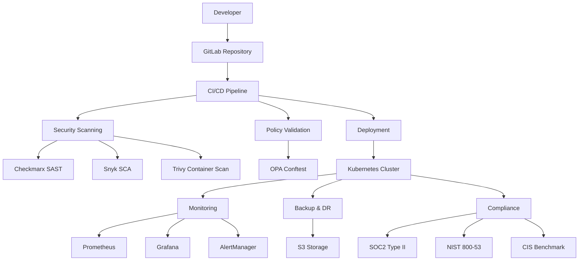

# Enterprise DevSecOps Pipeline Documentation

## Table of Contents

1. [Framework Overview](#framework-overview)
2. [Quick Start Guide](#quick-start-guide)
3. [Architecture Documentation](#architecture-documentation)
4. [Security Implementation](#security-implementation)
5. [Deployment Guide](#deployment-guide)
6. [Customization Guide](#customization-guide)
7. [Best Practices](#best-practices)
8. [Troubleshooting](#troubleshooting)
9. [Compliance & Governance](#compliance--governance)
10. [Advanced Configuration](#advanced-configuration)

## Framework Overview

### Purpose
This enterprise-grade DevSecOps pipeline provides a comprehensive, production-ready framework for secure containerized application deployment on Kubernetes. It implements industry-standard security scanning, policy enforcement, compliance validation, and operational excellence practices.

### Key Features
- **Security-First Design**: Integrated SAST, SCA, container scanning, and policy-as-code
- **Compliance Ready**: SOC2 Type II, NIST 800-53, CIS Kubernetes Benchmark
- **Production Hardened**: Zero-trust architecture, comprehensive monitoring, disaster recovery
- **Framework Approach**: Modular, customizable, and enterprise-adoptable

### Technology Stack
- **CI/CD**: GitLab CI/CD with multi-stage pipeline
- **Container Platform**: Kubernetes 1.24+ with Pod Security Standards
- **Security Tools**: Checkmarx (SAST), Snyk (SCA), Trivy (Container Security)
- **Policy Engine**: Open Policy Agent (OPA) with Conftest
- **Monitoring**: Prometheus, Grafana, AlertManager
- **Compliance**: Automated SOC2, NIST, CIS validation

## Quick Start Guide

### Prerequisites
- Kubernetes cluster (1.24+) with RBAC enabled
- GitLab instance with CI/CD runners
- Container registry access (Docker Hub, ECR, etc.)
- Security tool licenses (Checkmarx, Snyk)

### 1. Repository Setup
```bash
# Clone the repository
git clone https://github.com/your-org/secure-devsecops-pipeline.git
cd secure-devsecops-pipeline

# Review and update configuration files
cp .env.example .env
# Edit .env with your environment-specific values
```

### 2. Security Tool Configuration
```bash
# Configure Checkmarx
export CX_SERVER="https://your-checkmarx-server"
export CX_USERNAME="your-username"
export CX_PASSWORD="your-password"

# Configure Snyk
export SNYK_TOKEN="your-snyk-token"

# Configure container registry
export REGISTRY_URL="your-registry-url"
export REGISTRY_USERNAME="your-username"
export REGISTRY_PASSWORD="your-password"
```

### 3. Kubernetes Setup
```bash
# Create namespace
kubectl create namespace devsecops-pipeline-production

# Apply base configurations
kubectl apply -k k8s/base/

# Apply environment-specific overlays
kubectl apply -k k8s/overlays/production/
```

### 4. Pipeline Deployment
```bash
# Commit your configuration changes
git add .
git commit -m "Initial pipeline configuration"
git push origin main

# Pipeline will automatically trigger and execute all security gates
```

## Architecture Documentation

### High-Level Architecture



### Pipeline Stages

#### 1. Security Scanning Stage
- **SAST Analysis**: Checkmarx scans source code for security vulnerabilities
- **SCA Analysis**: Snyk identifies vulnerable dependencies
- **Parallel Execution**: Both scans run simultaneously for efficiency
- **Quality Gates**: Pipeline fails on high/critical findings

#### 2. Build & Test Stage
- **Container Build**: Docker image creation with security hardening
- **Unit Testing**: Automated test execution with coverage reporting
- **Image Tagging**: Semantic versioning and security metadata

#### 3. Container Security Stage
- **Vulnerability Scanning**: Trivy scans container images
- **Configuration Analysis**: Security best practices validation
- **Supply Chain Security**: Base image and dependency verification

#### 4. Policy Validation Stage
- **OPA Conftest**: Validates Kubernetes manifests against security policies
- **Policy Categories**: Container security, RBAC, network policies, Pod Security Standards
- **Compliance Mapping**: Policies mapped to compliance frameworks

#### 5. Deployment Stage
- **Environment Promotion**: Staging → Production deployment flow
- **Blue-Green Deployment**: Zero-downtime deployment strategy
- **Health Checks**: Comprehensive readiness and liveness probes

#### 6. Monitoring Stage
- **Metrics Collection**: Prometheus scraping and storage
- **Alerting**: Real-time security and performance alerts
- **Dashboard**: Grafana visualizations for operations teams

### Security Architecture

#### Defense in Depth Strategy

1. **Source Code Security**
   - Static Application Security Testing (SAST)
   - Software Composition Analysis (SCA)
   - Secret detection and prevention

2. **Container Security**
   - Base image vulnerability scanning
   - Container configuration hardening
   - Runtime security monitoring

3. **Kubernetes Security**
   - Pod Security Standards enforcement
   - Network micro-segmentation
   - RBAC with least privilege

4. **Infrastructure Security**
   - Encrypted storage and transit
   - Network policies and firewalls
   - Audit logging and monitoring

### Compliance Architecture

#### SOC2 Type II Controls
- **CC6.1**: Logical and physical access controls via RBAC and network policies
- **CC6.2**: Encryption in transit and at rest for all data
- **CC6.3**: System monitoring with Prometheus and alerting
- **CC6.6**: Vulnerability management through continuous scanning
- **CC6.7**: Data classification and handling via pod labels

#### NIST 800-53 Controls
- **Access Control (AC)**: Kubernetes RBAC implementation
- **Audit and Accountability (AU)**: Comprehensive logging and monitoring
- **Configuration Management (CM)**: Infrastructure as Code with GitOps
- **Contingency Planning (CP)**: Backup and disaster recovery procedures
- **System and Communications Protection (SC)**: Network encryption and segmentation

#### CIS Kubernetes Benchmark
- **5.1**: Pod Security Standards for container hardening
- **5.2**: Pod Security Policies enforcement
- **5.3**: Network policies for traffic control
- **5.7**: Secrets management and encryption

## Security Implementation

### Static Application Security Testing (SAST)

#### Checkmarx Configuration
```yaml
# security/configs/checkmarx-config.yaml
scan_settings:
  preset: "Checkmarx Default"
  engine_configuration: "Default Configuration"
  exclude_folders: "node_modules,vendor,target"
  exclude_files: "*.min.js,*.test.js"
  
security_gates:
  high_severity_threshold: 0
  medium_severity_threshold: 5
  low_severity_threshold: 20
  
compliance_mapping:
  - framework: "OWASP Top 10"
  - framework: "CWE Top 25"
  - framework: "SANS Top 25"
```

### Software Composition Analysis (SCA)

#### Snyk Configuration
```yaml
# security/configs/snyk-config.yaml
vulnerability_settings:
  severity_threshold: "high"
  fail_on: "upgradable"
  exclude_base_image_vulns: false
  
license_policy:
  - "GPL-2.0": "disallow"
  - "GPL-3.0": "disallow"
  - "AGPL-3.0": "disallow"
  
monitoring:
  frequency: "daily"
  notify_on_new: true
```

### Container Security

#### Trivy Configuration
```yaml
# security/configs/trivy-config.yaml
scan_settings:
  security_checks: "vuln,config,secret"
  severity: "UNKNOWN,LOW,MEDIUM,HIGH,CRITICAL"
  ignore_unfixed: false
  
format: "sarif"
output_file: "trivy-results.sarif"

security_gates:
  critical_threshold: 0
  high_threshold: 5
  medium_threshold: 20
```

### Policy as Code

#### OPA Policies Structure
```
security/policies/
├── kubernetes-security.rego      # Pod Security Standards
├── container-security.rego       # Container hardening
├── network-security.rego         # Network policies
├── rbac-security.rego            # RBAC validation
├── storage-security.rego         # Storage encryption
└── compliance/
    ├── soc2-controls.rego         # SOC2 Type II
    ├── nist-controls.rego         # NIST 800-53
    └── cis-benchmark.rego         # CIS Kubernetes
```

## Deployment Guide

### Environment Configuration

#### Development Environment
```bash
# Apply development overlay
kubectl apply -k k8s/overlays/development/

# Configure resource limits
kubectl patch deployment secure-app -n devsecops-pipeline-dev -p '
{
  "spec": {
    "template": {
      "spec": {
        "containers": [
          {
            "name": "secure-app",
            "resources": {
              "requests": {"cpu": "100m", "memory": "256Mi"},
              "limits": {"cpu": "500m", "memory": "512Mi"}
            }
          }
        ]
      }
    }
  }
}'
```

#### Staging Environment
```bash
# Apply staging overlay
kubectl apply -k k8s/overlays/staging/

# Verify deployment
kubectl get pods -n devsecops-pipeline-staging
kubectl get services -n devsecops-pipeline-staging
```

#### Production Environment
```bash
# Apply production overlay with all security hardening
kubectl apply -k k8s/overlays/production/

# Verify security configurations
kubectl get networkpolicies -n devsecops-pipeline-production
kubectl get podsecuritypolicy -n devsecops-pipeline-production
kubectl describe pod -l app=secure-app -n devsecops-pipeline-production
```

### Monitoring Setup

#### Prometheus Configuration
```yaml
# Apply monitoring stack
kubectl apply -f k8s/overlays/production/production-monitoring.yaml

# Verify Prometheus targets
kubectl port-forward svc/prometheus-operated 9090:9090 -n monitoring
# Access http://localhost:9090/targets
```

#### Grafana Dashboards
```bash
# Access Grafana
kubectl port-forward svc/grafana 3000:3000 -n monitoring
# Default credentials: admin/admin

# Import pre-configured dashboards:
# - Kubernetes Cluster Overview
# - Security Metrics Dashboard
# - Application Performance Dashboard
```

### Backup Configuration

#### Automated Backups
```bash
# Verify backup CronJob
kubectl get cronjobs -n devsecops-pipeline-production

# Manual backup execution
kubectl create job --from=cronjob/secure-app-backup manual-backup-$(date +%Y%m%d) -n devsecops-pipeline-production
```

## Customization Guide

### Adapting for Your Organization

#### 1. Security Tool Integration
```bash
# Replace Checkmarx with SonarQube
# Update scripts/security/checkmarx-scan.sh
# Modify .gitlab-ci.yml security-scan stage

# Add additional tools (e.g., Semgrep)
# Create scripts/security/semgrep-scan.sh
# Update pipeline configuration
```

#### 2. Policy Customization
```rego
# Example: Custom policy for your organization
package custom.security

# Deny containers running as root (except specific allowlist)
deny[msg] {
    input.kind == "Pod"
    input.spec.containers[_].securityContext.runAsUser == 0
    not input.metadata.annotations["security.policy/allow-root"] == "true"
    msg := "Container must not run as root user"
}

# Require specific labels for compliance
required_labels := ["data-classification", "business-unit", "cost-center"]

deny[msg] {
    input.kind == "Pod"
    required_label := required_labels[_]
    not input.metadata.labels[required_label]
    msg := sprintf("Missing required label: %v", [required_label])
}
```

#### 3. Environment-Specific Configuration
```yaml
# k8s/overlays/your-environment/kustomization.yaml
apiVersion: kustomize.config.k8s.io/v1beta1
kind: Kustomization

namespace: your-namespace

resources:
- ../../base

patchesStrategicMerge:
- deployment-patch.yaml
- service-patch.yaml

configMapGenerator:
- name: app-config
  files:
  - config/application.properties

secretGenerator:
- name: app-secrets
  files:
  - secrets/database.properties

images:
- name: secure-app
  newTag: your-version
```

### Framework Extension

#### Adding New Security Tools
1. Create tool-specific script in `scripts/security/`
2. Add configuration file in `security/configs/`
3. Update `.gitlab-ci.yml` to include new stage
4. Add policy validation if needed
5. Update documentation

#### Custom Compliance Frameworks
1. Create new policy files in `security/policies/compliance/`
2. Map controls to existing security measures
3. Add compliance validation to automated checks
4. Update reporting and documentation

## Best Practices

### Security Best Practices

#### 1. Shift-Left Security
- Integrate security scanning early in development
- Use pre-commit hooks for basic security checks
- Implement security training for developers
- Regular security architecture reviews

#### 2. Zero Trust Architecture
- Never trust, always verify principle
- Micro-segmentation with network policies
- Least privilege access controls
- Continuous verification and monitoring

#### 3. Secrets Management
```yaml
# Use external secret management
apiVersion: external-secrets.io/v1beta1
kind: ExternalSecret
metadata:
  name: app-secrets
spec:
  refreshInterval: 1h
  secretStoreRef:
    name: vault-backend
    kind: SecretStore
  target:
    name: app-secrets
    creationPolicy: Owner
  data:
  - secretKey: database-password
    remoteRef:
      key: secret/data/database
      property: password
```

### Operational Best Practices

#### 1. GitOps Workflow
- All infrastructure changes through Git
- Peer review for all modifications
- Automated deployment validation
- Rollback procedures documented

#### 2. Monitoring and Alerting
```yaml
# Critical alerts configuration
groups:
- name: security.rules
  rules:
  - alert: HighSeverityVulnerability
    expr: trivy_vulnerabilities{severity="HIGH"} > 0
    for: 0m
    labels:
      severity: critical
    annotations:
      summary: "High severity vulnerability detected"
      
  - alert: PolicyViolation
    expr: conftest_policy_violations > 0
    for: 0m
    labels:
      severity: warning
    annotations:
      summary: "OPA policy violation detected"
```

#### 3. Incident Response
- Automated evidence collection
- Predefined response procedures
- Communication templates
- Post-incident review process

### Performance Best Practices

#### 1. Resource Optimization
- Right-size containers based on actual usage
- Implement horizontal and vertical autoscaling
- Use resource quotas and limits
- Regular performance tuning

#### 2. Security Performance Balance
- Optimize security scanning for speed
- Parallel execution where possible
- Cache security scan results
- Incremental scanning strategies

## Troubleshooting

### Common Issues and Solutions

#### 1. Pipeline Failures

**SAST Scan Timeout**
```bash
# Increase timeout in .gitlab-ci.yml
checkmarx-sast:
  timeout: 2h  # Increase from default 1h
  
# Exclude large files/folders
# Update security/configs/checkmarx-config.yaml
exclude_folders: "node_modules,vendor,target,dist"
```

**Container Build Failures**
```bash
# Check Docker daemon
docker info

# Verify registry credentials
docker login $REGISTRY_URL

# Debug build process
docker build --no-cache -t debug-image .
```

**Policy Validation Errors**
```bash
# Test policies locally
conftest verify --policy security/policies/ k8s/

# Debug specific policy
conftest verify --policy security/policies/kubernetes-security.rego k8s/base/deployment.yaml --trace
```

#### 2. Deployment Issues

**Pod Security Policy Violations**
```bash
# Check PSP events
kubectl get events -n devsecops-pipeline-production | grep "FailedCreate"

# Validate security context
kubectl describe pod failing-pod -n devsecops-pipeline-production
```

**Network Policy Blocking Traffic**
```bash
# Test connectivity
kubectl exec -it test-pod -- nc -zv service-name 8080

# Temporarily allow all traffic for debugging
kubectl apply -f - <<EOF
apiVersion: networking.k8s.io/v1
kind: NetworkPolicy
metadata:
  name: debug-allow-all
  namespace: devsecops-pipeline-production
spec:
  podSelector: {}
  policyTypes: []
EOF
```

#### 3. Monitoring Issues

**Missing Metrics**
```bash
# Verify Prometheus targets
kubectl port-forward svc/prometheus-operated 9090:9090 -n monitoring
# Check http://localhost:9090/targets

# Restart metrics collection
kubectl rollout restart deployment/prometheus-operator -n monitoring
```

**Alert Manager Not Firing**
```bash
# Check AlertManager configuration
kubectl get alertmanagerconfigs -n monitoring

# Verify alert rules
kubectl get prometheusrules -n monitoring
```

### Debug Commands

#### Security Scanning Debug
```bash
# Run security scan manually
docker run --rm -v $(pwd):/code checkmarx/kics:latest scan -p /code --report-formats json -o /code/results.json

# Test Snyk integration
snyk test --json > snyk-results.json

# Trivy debug scan
trivy fs --format json --output trivy-results.json .
```

#### Kubernetes Debug
```bash
# Pod troubleshooting
kubectl describe pod pod-name -n namespace
kubectl logs pod-name -n namespace --previous
kubectl exec -it pod-name -n namespace -- /bin/sh

# Network troubleshooting
kubectl get networkpolicies -n namespace
kubectl describe networkpolicy policy-name -n namespace

# RBAC troubleshooting
kubectl auth can-i create pods --as=system:serviceaccount:namespace:serviceaccount
```

## Compliance & Governance

### Compliance Reporting

#### Automated Compliance Checks
```bash
# SOC2 Type II validation
kubectl create job --from=cronjob/compliance-check soc2-check-$(date +%Y%m%d) -n devsecops-pipeline-production

# NIST 800-53 assessment
kubectl exec -it compliance-pod -n devsecops-pipeline-production -- /compliance-config/compliance-check.sh nist

# CIS Kubernetes Benchmark
kubectl exec -it compliance-pod -n devsecops-pipeline-production -- /compliance-config/compliance-check.sh cis
```

#### Compliance Artifacts
- Security scan reports in SARIF format
- Policy validation results
- Audit logs and monitoring data
- Backup and recovery documentation
- Incident response records

### Governance Framework

#### 1. Security Governance
- Security policies and procedures
- Regular security assessments
- Vulnerability management program
- Security training and awareness

#### 2. Operational Governance
- Change management processes
- Release management procedures
- Performance monitoring and optimization
- Capacity planning and scaling

#### 3. Compliance Governance
- Regulatory compliance tracking
- Audit preparation and execution
- Evidence collection and retention
- Continuous compliance monitoring

### Risk Management

#### Security Risk Assessment
1. **Asset Identification**: Applications, data, infrastructure
2. **Threat Modeling**: Potential attack vectors and scenarios
3. **Vulnerability Assessment**: Current security gaps
4. **Risk Evaluation**: Impact and likelihood analysis
5. **Mitigation Planning**: Security controls implementation

#### Operational Risk Management
1. **Availability Risks**: Backup, disaster recovery, redundancy
2. **Performance Risks**: Scaling, optimization, monitoring
3. **Security Risks**: Continuous scanning, policy enforcement
4. **Compliance Risks**: Regular audits, documentation maintenance

## Advanced Configuration

### High Availability Setup

#### Multi-Region Deployment
```yaml
# Production deployment with region affinity
apiVersion: apps/v1
kind: Deployment
metadata:
  name: secure-app-ha
spec:
  replicas: 6
  template:
    spec:
      affinity:
        podAntiAffinity:
          preferredDuringSchedulingIgnoredDuringExecution:
          - weight: 100
            podAffinityTerm:
              labelSelector:
                matchExpressions:
                - key: app
                  operator: In
                  values:
                  - secure-app
              topologyKey: topology.kubernetes.io/zone
```

#### Database High Availability
```yaml
# PostgreSQL HA with replication
apiVersion: postgresql.cnpg.io/v1
kind: Cluster
metadata:
  name: postgres-ha
spec:
  instances: 3
  postgresql:
    parameters:
      max_connections: "200"
      shared_buffers: "256MB"
      effective_cache_size: "1GB"
  monitoring:
    enabled: true
```

### Advanced Security Configuration

#### Service Mesh Integration
```yaml
# Istio security policies
apiVersion: security.istio.io/v1beta1
kind: PeerAuthentication
metadata:
  name: default
  namespace: devsecops-pipeline-production
spec:
  mtls:
    mode: STRICT

---
apiVersion: security.istio.io/v1beta1
kind: AuthorizationPolicy
metadata:
  name: secure-app-authz
  namespace: devsecops-pipeline-production
spec:
  selector:
    matchLabels:
      app: secure-app
  rules:
  - from:
    - source:
        principals: ["cluster.local/ns/devsecops-pipeline-production/sa/secure-app"]
  - to:
    - operation:
        methods: ["GET", "POST"]
```

#### Advanced OPA Policies
```rego
package advanced.security

import future.keywords.contains
import future.keywords.if
import future.keywords.in

# Advanced RBAC validation
deny contains msg if {
    input.kind == "RoleBinding"
    subject := input.subjects[_]
    subject.kind == "User"
    contains(subject.name, "admin")
    not input.metadata.annotations["security.approved"] == "true"
    msg := "Admin user bindings require security approval"
}

# Data sovereignty compliance
deny contains msg if {
    input.kind == "Pod"
    input.spec.containers[_].image
    not allowed_regions[input.metadata.labels["data-region"]]
    msg := "Pod must be deployed in approved data regions"
}

allowed_regions := {
    "us-east-1",
    "us-west-2",
    "eu-west-1"
}
```

### Performance Optimization

#### Advanced Autoscaling
```yaml
# Custom metrics autoscaling
apiVersion: autoscaling/v2
kind: HorizontalPodAutoscaler
metadata:
  name: secure-app-custom-hpa
spec:
  scaleTargetRef:
    apiVersion: apps/v1
    kind: Deployment
    name: secure-app
  minReplicas: 3
  maxReplicas: 50
  metrics:
  - type: Pods
    pods:
      metric:
        name: custom_requests_per_second
      target:
        type: AverageValue
        averageValue: "30"
  - type: External
    external:
      metric:
        name: queue_length
        selector:
          matchLabels:
            queue: "worker-queue"
      target:
        type: Value
        value: "30"
```

#### Resource Optimization
```yaml
# Vertical Pod Autoscaler with custom policies
apiVersion: autoscaling.k8s.io/v1
kind: VerticalPodAutoscaler
metadata:
  name: secure-app-vpa-advanced
spec:
  targetRef:
    apiVersion: apps/v1
    kind: Deployment
    name: secure-app
  updatePolicy:
    updateMode: "Auto"
  resourcePolicy:
    containerPolicies:
    - containerName: secure-app
      mode: "Auto"
      minAllowed:
        cpu: 100m
        memory: 128Mi
      maxAllowed:
        cpu: 4000m
        memory: 8Gi
      controlledResources: ["cpu", "memory"]
      controlledValues: RequestsAndLimits
```

### Integration Examples

#### External Secrets Integration
```yaml
# AWS Secrets Manager integration
apiVersion: external-secrets.io/v1beta1
kind: SecretStore
metadata:
  name: aws-secrets-manager
  namespace: devsecops-pipeline-production
spec:
  provider:
    aws:
      service: SecretsManager
      region: us-west-2
      auth:
        secretRef:
          accessKeyID:
            name: awssm-secret
            key: access-key
          secretAccessKey:
            name: awssm-secret
            key: secret-access-key
```

#### ArgoCD GitOps Integration
```yaml
# ArgoCD Application for GitOps
apiVersion: argoproj.io/v1alpha1
kind: Application
metadata:
  name: secure-devsecops-pipeline
  namespace: argocd
spec:
  project: default
  source:
    repoURL: https://github.com/your-org/secure-devsecops-pipeline.git
    targetRevision: HEAD
    path: k8s/overlays/production
  destination:
    server: https://kubernetes.default.svc
    namespace: devsecops-pipeline-production
  syncPolicy:
    automated:
      prune: true
      selfHeal: true
    syncOptions:
    - CreateNamespace=true
    - PruneLast=true
    - RespectIgnoreDifferences=true
```

---

## Support and Maintenance

### Regular Maintenance Tasks

#### Weekly
- Review security scan results
- Update dependency versions
- Check compliance status
- Performance optimization review

#### Monthly
- Security policy updates
- Infrastructure capacity planning
- Disaster recovery testing
- Documentation updates

#### Quarterly
- Full security assessment
- Compliance audit preparation
- Framework optimization review
- Team training and updates

### Getting Help

#### Community Support
- GitHub Issues: Report bugs and feature requests
- Documentation Wiki: Community-contributed guides
- Discussion Forum: Best practices and Q&A

#### Enterprise Support
- Professional Services: Implementation assistance
- Training Programs: Team onboarding and certification
- Support Contracts: 24/7 technical support

### Contributing

#### How to Contribute
1. Fork the repository
2. Create a feature branch
3. Implement your changes
4. Add tests and documentation
5. Submit a pull request

#### Development Guidelines
- Follow security best practices
- Include comprehensive tests
- Update documentation
- Maintain backward compatibility

---

*This documentation is maintained by the DevSecOps Pipeline team. For questions or suggestions, please open an issue in the repository.*