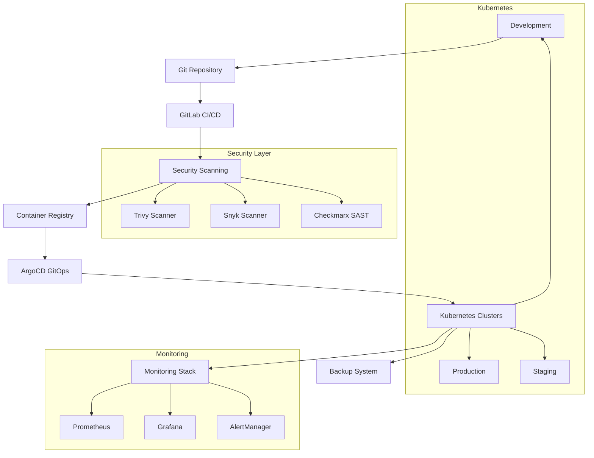

# Secure DevSecOps Pipeline

## Overview

The Secure DevSecOps Pipeline is a production-ready, enterprise-grade DevSecOps platform that integrates security at every stage of the software development lifecycle. It provides automated security scanning, compliance monitoring, and infrastructure as code with GitOps workflows.

### Key Features
- ✅ **Advanced Security**: RBAC, Pod Security Standards, Network Policies, OPA Gatekeeper
- ✅ **CI/CD Pipeline**: Parallel execution, matrix builds, advanced caching
- ✅ **Comprehensive Monitoring**: Prometheus, Grafana, AlertManager with SLI/SLO tracking
- ✅ **Infrastructure as Code**: Terraform modules, Helm charts, environment automation
- ✅ **Testing Framework**: Unit, integration, e2e, performance, and security tests
- ✅ **GitOps Workflows**: ArgoCD with automated deployments and rollbacks
- ✅ **Backup & DR**: Velero-based backup with disaster recovery procedures
- ✅ **Documentation**: Complete operational runbooks and troubleshooting guides

### Technology Stack
- **Container Orchestration**: Kubernetes
- **CI/CD**: GitLab CI/CD
- **GitOps**: ArgoCD
- **Monitoring**: Prometheus, Grafana, AlertManager
- **Security Scanning**: Trivy, Snyk, Checkmarx
- **Infrastructure**: Terraform, Helm
- **Backup**: Velero
- **Testing**: Jest, Puppeteer, K6, Autocannon

## Architecture



### Environment Flow
```
Development → Staging → Production
     ↓           ↓         ↓
   Testing   UAT Testing  Monitoring
     ↓           ↓         ↓
  Security   Security   Security
  Scanning   Scanning   Scanning
```

## Quick Start

### Prerequisites
- Kubernetes cluster (1.24+)
- kubectl configured
- Helm 3.0+
- ArgoCD CLI
- Docker
- Git

