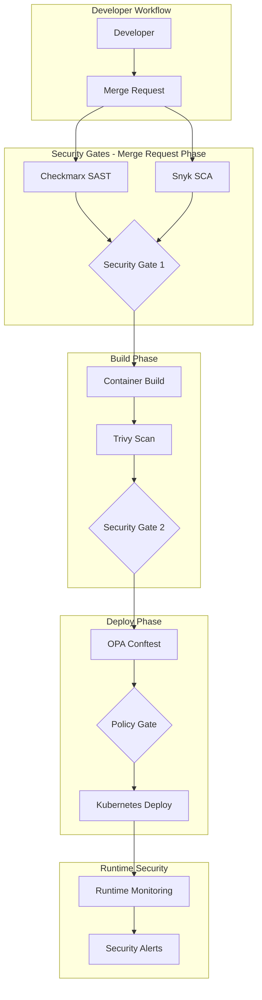
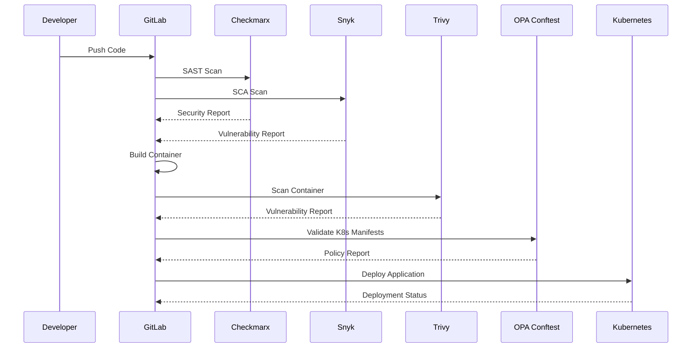

# Enterprise DevSecOps Pipeline for Containerized Workloads

[](https://github.com/your-org/secure-devsecops-pipeline)
[](https://github.com/your-org/secure-devsecops-pipeline)
[](https://github.com/your-org/secure-devsecops-pipeline)
[](https://github.com/your-org/secure-devsecops-pipeline)

##  **Overview**

A comprehensive, enterprise-grade DevSecOps pipeline framework that integrates security scanning, policy enforcement, and compliance validation into your containerized application deployment workflow. Built for Kubernetes with GitLab CI/CD, this framework implements industry best practices for secure software delivery.

### **Key Features**

- ** Security-First Design**: Integrated SAST, SCA, container scanning, and policy-as-code
- ** Compliance Ready**: SOC2 Type II, NIST 800-53, CIS Kubernetes Benchmark
- **Production Hardened**: Zero-trust architecture, comprehensive monitoring, disaster recovery
- ** Framework Approach**: Modular, customizable, and enterprise-adoptable
- ** Operational Excellence**: Automated monitoring, alerting, performance optimization

### **Technology Stack**

- **CI/CD**: GitLab CI/CD with multi-stage pipeline
- **Container Platform**: Kubernetes 1.24+ with Pod Security Standards
- **Security Tools**: Checkmarx (SAST), Snyk (SCA), Trivy (Container Security)
- **Policy Engine**: Open Policy Agent (OPA) with Conftest
- **Monitoring**: Prometheus, Grafana, AlertManager
- **Compliance**: Automated SOC2, NIST, CIS validation

##  **Table of Contents**

- [Architecture Overview](#architecture-overview)
- [Quick Start Guide](#quick-start-guide)
- [Prerequisites](#prerequisites)
- [Implementation Guide](#implementation-guide)
- [Security Implementation](#security-implementation)
- [Pipeline Configuration](#pipeline-configuration)
- [Kubernetes Deployment](#kubernetes-deployment)
- [Monitoring & Observability](#monitoring--observability)
- [Compliance & Governance](#compliance--governance)
- [Customization Guide](#customization-guide)
- [Troubleshooting](#troubleshooting)
- [Best Practices](#best-practices)
- [Advanced Configuration](#advanced-configuration)
- [Contributing](#contributing)

##  **Architecture Overview**

### **System Architecture**



### **Security-First Design Principles**

1. **Shift-Left Security**: Security validation at every stage
2. **Zero-Trust Architecture**: Verify everything, trust nothing
3. **Fail-Fast**: Stop pipeline on critical security findings
4. **Policy as Code**: Automated policy enforcement
5. **Immutable Infrastructure**: Container-based deployments
6. **Continuous Monitoring**: Runtime security observability

### **Pipeline Stages**

```yaml
stages:
  - security-scan      # SAST + SCA (Merge Request)
  - build-test        # Application build and unit tests
  - container-security # Container vulnerability scanning
  - policy-validation # OPA Conftest validation
  - deploy           # Kubernetes deployment
  - monitor          # Post-deployment monitoring
```

### **Data Flow Architecture**



##  **Quick Start Guide**

### **1. Repository Setup**
```bash
# Clone the repository
git clone https://github.com/your-org/secure-devsecops-pipeline.git
cd secure-devsecops-pipeline

# Review and update configuration files
cp .env.example .env
# Edit .env with your environment-specific values
```

### **2. Security Tool Configuration**
```bash
# Configure Checkmarx
export CX_SERVER="https://your-checkmarx-server"
export CX_USERNAME="your-username"
export CX_PASSWORD="your-password"

# Configure Snyk
export SNYK_TOKEN="your-snyk-token"

# Configure container registry
export REGISTRY_URL="your-registry-url"
export REGISTRY_USERNAME="your-username"
export REGISTRY_PASSWORD="your-password"
```

### **3. Kubernetes Setup**
```bash
# Create namespace
kubectl create namespace devsecops-pipeline-production

# Apply base configurations
kubectl apply -k k8s/base/

# Apply environment-specific overlays
kubectl apply -k k8s/overlays/production/
```

### **4. Pipeline Deployment**
```bash
# Commit your configuration changes
git add .
git commit -m "Initial pipeline configuration"
git push origin main

# Pipeline will automatically trigger and execute all security gates
```

##  **Prerequisites**

### **Required Tools and Services**

- **GitLab Instance**: GitLab Premium/Ultimate for advanced security features
- **Kubernetes Cluster**: v1.24+ with RBAC enabled
- **Container Registry**: Secure container registry with vulnerability scanning
- **Security Tools Access**:
  - Checkmarx CxSAST license and API access
  - Snyk account with API token
  - Trivy scanner (open source)
  - OPA Conftest (open source)

### **Environment Setup**

#### **GitLab Configuration**

```bash
# GitLab Runner registration (requires admin access)
gitlab-runner register \
  --url "${GITLAB_URL}" \
  --registration-token "${REGISTRATION_TOKEN}" \
  --executor docker \
  --docker-image alpine:latest \
  --description "DevSecOps Pipeline Runner" \
  --tag-list "devsecops,security,kubernetes"
```

#### **Kubernetes Cluster Setup**

```yaml
# namespace-devsecops.yaml
apiVersion: v1
kind: Namespace
metadata:
  name: devsecops-pipeline
  labels:
    security.policy/enforce: "strict"
    compliance.framework: "cis-k8s"
---
apiVersion: v1
kind: ServiceAccount
metadata:
  name: pipeline-deployer
  namespace: devsecops-pipeline
---
apiVersion: rbac.authorization.k8s.io/v1
kind: ClusterRole
metadata:
  name: pipeline-deployer
rules:
- apiGroups: [""]
  resources: ["pods", "services", "configmaps", "secrets"]
  verbs: ["get", "list", "create", "update", "patch", "delete"]
- apiGroups: ["apps"]
  resources: ["deployments", "replicasets"]
  verbs: ["get", "list", "create", "update", "patch", "delete"]
- apiGroups: ["networking.k8s.io"]
  resources: ["networkpolicies"]
  verbs: ["get", "list", "create", "update", "patch", "delete"]
```

## 🔧 **Implementation Guide**

### **Phase 1: Basic Pipeline Setup**

1. **Import Project Structure**
   ```bash
   git clone <this-repository>
   cd secure-devsecops-pipeline
   ```

2. **Configure Pipeline Variables**
   - Navigate to GitLab Project → Settings → CI/CD → Variables
   - Add all required variables from the list below
   - Ensure sensitive variables are masked and protected

3. **Validate Pipeline Syntax**
   ```bash
   # Use GitLab CI Lint tool
   curl --header "PRIVATE-TOKEN: <your_access_token>" \
        "https://gitlab.example.com/api/v4/ci/lint" \
        --header "Content-Type: application/json" \
        --data '{"content": "$(cat .gitlab-ci.yml)"}'
   ```

### **GitLab CI/CD Variables Configuration**

#### **Required Variables (Protected & Masked)**

```bash
# Security Tool API Keys
CHECKMARX_URL="https://your-checkmarx-instance.com"
CHECKMARX_USERNAME="service-account"
CHECKMARX_PASSWORD="secure-password"
SNYK_TOKEN="snyk-api-token"

# Container Registry
CI_REGISTRY="your-registry.com"
CI_REGISTRY_USER="registry-user"
CI_REGISTRY_PASSWORD="registry-password"

# Kubernetes
KUBE_CONFIG="base64-encoded-kubeconfig"
KUBE_NAMESPACE="devsecops-pipeline"

# Monitoring and Alerting
SLACK_WEBHOOK_URL="https://hooks.slack.com/services/..."
PROMETHEUS_URL="https://prometheus.monitoring.svc.cluster.local"
```

### **Phase 2: Security Tool Integration**

1. **Checkmarx SAST Configuration**
   - Verify Checkmarx server connectivity
   - Create project in Checkmarx portal
   - Configure scan presets and engine configurations

2. **Snyk SCA Setup**
   - Authenticate Snyk CLI with token
   - Configure organization and project settings
   - Set vulnerability thresholds

3. **Trivy Container Scanning**
   - Configure Trivy database updates
   - Set CVE severity thresholds
   - Configure ignore policies for false positives

### **Phase 3: Policy as Code Implementation**

1. **OPA Conftest Policies**
   - Review and customize Kubernetes policies
   - Test policies against sample manifests
   - Configure policy violation handling

2. **Kubernetes RBAC**
   - Apply service accounts and role bindings
   - Validate least privilege access
   - Configure network policies

### **Phase 4: Monitoring and Observability**

1. **Prometheus Metrics**
   - Configure pipeline metrics collection
   - Set up security scan result metrics
   - Configure alerting rules

2. **Grafana Dashboards**
   - Import pre-built security dashboards
   - Configure data sources
   - Set up notification channels

## 🔒 **Security Implementation**

### **Security Gates and Thresholds**

#### **Gate 1: Merge Request Security**
- **SAST**: No high/critical vulnerabilities
- **SCA**: No critical dependencies vulnerabilities
- **Code Quality**: Minimum quality score threshold

#### **Gate 2: Container Security**
- **Image Scan**: No critical CVEs
- **Base Image**: Approved base images only
- **Image Signing**: Signed and verified images

#### **Gate 3: Policy Validation**
- **Resource Limits**: CPU/Memory limits defined
- **Security Context**: Non-root containers
- **Network Policies**: Proper network segmentation
- **RBAC**: Least privilege access

### **Static Application Security Testing (SAST)**

#### **Checkmarx Configuration**
```yaml
# security/configs/checkmarx-config.yaml
scan_settings:
  preset: "Checkmarx Default"
  engine_configuration: "Default Configuration"
  exclude_folders: "node_modules,vendor,target"
  exclude_files: "*.min.js,*.test.js"
  
security_gates:
  high_severity_threshold: 0
  medium_severity_threshold: 5
  low_severity_threshold: 20
  
compliance_mapping:
  - framework: "OWASP Top 10"
  - framework: "CWE Top 25"
  - framework: "SANS Top 25"
```

### **Software Composition Analysis (SCA)**

#### **Snyk Configuration**
```yaml
# security/configs/snyk-config.yaml
vulnerability_settings:
  severity_threshold: "high"
  fail_on: "upgradable"
  exclude_base_image_vulns: false
  
license_policy:
  - "GPL-2.0": "disallow"
  - "GPL-3.0": "disallow"
  - "AGPL-3.0": "disallow"
  
monitoring:
  frequency: "daily"
  notify_on_new: true
```

### **Container Security**

#### **Trivy Configuration**
```yaml
# security/configs/trivy-config.yaml
scan_settings:
  security_checks: "vuln,config,secret"
  severity: "UNKNOWN,LOW,MEDIUM,HIGH,CRITICAL"
  ignore_unfixed: false
  
format: "sarif"
output_file: "trivy-results.sarif"

security_gates:
  critical_threshold: 0
  high_threshold: 5
  medium_threshold: 20
```

### **Policy as Code**

#### **OPA Policies Structure**
```
security/policies/
├── kubernetes-security.rego      # Pod Security Standards
├── container-security.rego       # Container hardening
├── network-security.rego         # Network policies
├── rbac-security.rego            # RBAC validation
├── storage-security.rego         # Storage encryption
└── compliance/
    ├── soc2-controls.rego         # SOC2 Type II
    ├── nist-controls.rego         # NIST 800-53
    └── cis-benchmark.rego         # CIS Kubernetes
```

## ⚙️ **Pipeline Configuration**

The GitLab CI/CD pipeline consists of six main stages:

### **1. Security Scanning Stage**
- **SAST Analysis**: Checkmarx scans source code for security vulnerabilities
- **SCA Analysis**: Snyk identifies vulnerable dependencies
- **Parallel Execution**: Both scans run simultaneously for efficiency
- **Quality Gates**: Pipeline fails on high/critical findings

### **2. Build & Test Stage**
- **Container Build**: Docker image creation with security hardening
- **Unit Testing**: Automated test execution with coverage reporting
- **Image Tagging**: Semantic versioning and security metadata

### **3. Container Security Stage**
- **Vulnerability Scanning**: Trivy scans container images
- **Configuration Analysis**: Security best practices validation
- **Supply Chain Security**: Base image and dependency verification

### **4. Policy Validation Stage**
- **OPA Conftest**: Validates Kubernetes manifests against security policies
- **Policy Categories**: Container security, RBAC, network policies, Pod Security Standards
- **Compliance Mapping**: Policies mapped to compliance frameworks

### **5. Deployment Stage**
- **Environment Promotion**: Staging → Production deployment flow
- **Blue-Green Deployment**: Zero-downtime deployment strategy
- **Health Checks**: Comprehensive readiness and liveness probes

### **6. Monitoring Stage**
- **Metrics Collection**: Prometheus scraping and storage
- **Alerting**: Real-time security and performance alerts
- **Dashboard**: Grafana visualizations for operations teams

## ☸️ **Kubernetes Deployment**

### **Environment Configuration**

#### **Development Environment**
```bash
# Apply development overlay
kubectl apply -k k8s/overlays/development/

# Configure resource limits
kubectl patch deployment secure-app -n devsecops-pipeline-dev -p '
{
  "spec": {
    "template": {
      "spec": {
        "containers": [
          {
            "name": "secure-app",
            "resources": {
              "requests": {"cpu": "100m", "memory": "256Mi"},
              "limits": {"cpu": "500m", "memory": "512Mi"}
            }
          }
        ]
      }
    }
  }
}'
```

#### **Production Environment**
```bash
# Apply production overlay with all security hardening
kubectl apply -k k8s/overlays/production/

# Verify security configurations
kubectl get networkpolicies -n devsecops-pipeline-production
kubectl get podsecuritypolicy -n devsecops-pipeline-production
kubectl describe pod -l app=secure-app -n devsecops-pipeline-production
```

### **Security Architecture**

#### **Defense in Depth Strategy**

1. **Source Code Security**
   - Static Application Security Testing (SAST)
   - Software Composition Analysis (SCA)
   - Secret detection and prevention

2. **Container Security**
   - Base image vulnerability scanning
   - Container configuration hardening
   - Runtime security monitoring

3. **Kubernetes Security**
   - Pod Security Standards enforcement
   - Network micro-segmentation
   - RBAC with least privilege

4. **Infrastructure Security**
   - Encrypted storage and transit
   - Network policies and firewalls
   - Audit logging and monitoring

## 📊 **Monitoring & Observability**

### **Monitoring Setup**

#### **Prometheus Configuration**
```yaml
# Apply monitoring stack
kubectl apply -f k8s/overlays/production/production-monitoring.yaml

# Verify Prometheus targets
kubectl port-forward svc/prometheus-operated 9090:9090 -n monitoring
# Access http://localhost:9090/targets
```

#### **Grafana Dashboards**
```bash
# Access Grafana
kubectl port-forward svc/grafana 3000:3000 -n monitoring
# Default credentials: admin/admin

# Import pre-configured dashboards:
# - Kubernetes Cluster Overview
# - Security Metrics Dashboard
# - Application Performance Dashboard
```

### **Key Metrics**

- **Security Metrics**: Vulnerability counts, policy violations, scan durations
- **Performance Metrics**: Response times, throughput, error rates
- **Infrastructure Metrics**: Resource utilization, node health, storage usage
- **Compliance Metrics**: Policy adherence, audit trail coverage

### **Alerting**

#### **Critical Alerts**
- High/Critical security vulnerabilities detected
- Policy violations in production
- Container security scan failures
- Deployment failures or rollbacks

#### **Warning Alerts**
- Medium severity vulnerabilities
- Performance degradation
- Resource utilization thresholds
- Backup/DR process failures

## 📋 **Compliance & Governance**

### **Compliance Architecture**

#### **SOC2 Type II Controls**
- **CC6.1**: Logical and physical access controls via RBAC and network policies
- **CC6.2**: Encryption in transit and at rest for all data
- **CC6.3**: System monitoring with Prometheus and alerting
- **CC6.6**: Vulnerability management through continuous scanning
- **CC6.7**: Data classification and handling via pod labels

#### **NIST 800-53 Controls**
- **Access Control (AC)**: Kubernetes RBAC implementation
- **Audit and Accountability (AU)**: Comprehensive logging and monitoring
- **Configuration Management (CM)**: Infrastructure as Code with GitOps
- **Contingency Planning (CP)**: Backup and disaster recovery procedures
- **System and Communications Protection (SC)**: Network encryption and segmentation

#### **CIS Kubernetes Benchmark**
- **5.1**: Pod Security Standards for container hardening
- **5.2**: Pod Security Policies enforcement
- **5.3**: Network policies for traffic control
- **5.7**: Secrets management and encryption

### **Automated Compliance Validation**

```bash
# SOC2 Type II validation
kubectl create job --from=cronjob/compliance-check soc2-check-$(date +%Y%m%d) -n devsecops-pipeline-production

# NIST 800-53 assessment
kubectl exec -it compliance-pod -n devsecops-pipeline-production -- /compliance-config/compliance-check.sh nist

# CIS Kubernetes Benchmark
kubectl exec -it compliance-pod -n devsecops-pipeline-production -- /compliance-config/compliance-check.sh cis
```

### **Backup Configuration**

#### **Automated Backups**
```bash
# Verify backup CronJob
kubectl get cronjobs -n devsecops-pipeline-production

# Manual backup execution
kubectl create job --from=cronjob/secure-app-backup manual-backup-$(date +%Y%m%d) -n devsecops-pipeline-production
```

## 🛠️ **Customization Guide**

### **Adapting for Your Organization**

#### **1. Security Tool Integration**
```bash
# Replace Checkmarx with SonarQube
# Update scripts/security/checkmarx-scan.sh
# Modify .gitlab-ci.yml security-scan stage

# Add additional tools (e.g., Semgrep)
# Create scripts/security/semgrep-scan.sh
# Update pipeline configuration
```

#### **2. Policy Customization**
```rego
# Example: Custom policy for your organization
package custom.security

# Deny containers running as root (except specific allowlist)
deny[msg] {
    input.kind == "Pod"
    input.spec.containers[_].securityContext.runAsUser == 0
    not input.metadata.annotations["security.policy/allow-root"] == "true"
    msg := "Container must not run as root user"
}

# Require specific labels for compliance
required_labels := ["data-classification", "business-unit", "cost-center"]

deny[msg] {
    input.kind == "Pod"
    required_label := required_labels[_]
    not input.metadata.labels[required_label]
    msg := sprintf("Missing required label: %v", [required_label])
}
```

#### **3. Environment-Specific Configuration**
```yaml
# k8s/overlays/your-environment/kustomization.yaml
apiVersion: kustomize.config.k8s.io/v1beta1
kind: Kustomization

namespace: your-namespace

resources:
- ../../base

patchesStrategicMerge:
- deployment-patch.yaml
- service-patch.yaml

configMapGenerator:
- name: app-config
  files:
  - config/application.properties

secretGenerator:
- name: app-secrets
  files:
  - secrets/database.properties

images:
- name: secure-app
  newTag: your-version
```

### **Framework Extension**

#### **Adding New Security Tools**
1. Create tool-specific script in `scripts/security/`
2. Add configuration file in `security/configs/`
3. Update `.gitlab-ci.yml` to include new stage
4. Add policy validation if needed
5. Update documentation

#### **Custom Compliance Frameworks**
1. Create new policy files in `security/policies/compliance/`
2. Map controls to existing security measures
3. Add compliance validation to automated checks
4. Update reporting and documentation

## 🔍 **Troubleshooting**

### **Testing and Validation**

#### **Security Gate Testing**

```bash
# Test SAST gate with intentionally vulnerable code
echo 'password = "hardcoded123"' > test-vuln.py
git add test-vuln.py && git commit -m "Test SAST detection"
git push origin feature/test-sast

# Test container security gate
docker build -t test-image:vuln -f Dockerfile.vulnerable .
docker push ${CI_REGISTRY}/test-image:vuln

# Test policy validation
kubectl apply --dry-run=client -f k8s/invalid-manifest.yaml
```

#### **Pipeline Validation Checklist**

- [ ] SAST scan completes and reports vulnerabilities
- [ ] SCA scan identifies dependency vulnerabilities
- [ ] Container scan detects image vulnerabilities
- [ ] Policy validation catches non-compliant manifests
- [ ] Security gates properly fail pipeline on critical findings
- [ ] Deployment succeeds with compliant configurations
- [ ] Monitoring and alerting function correctly

### **Common Issues and Solutions**

#### **Pipeline Failures**

**SAST Scan Timeout**
```yaml
# Increase timeout in .gitlab-ci.yml
checkmarx-sast:
  timeout: 2h
  retry:
    max: 2
    when: runner_system_failure
```

**Container Registry Authentication**
```bash
# Verify registry credentials
docker login ${CI_REGISTRY} -u ${CI_REGISTRY_USER} -p ${CI_REGISTRY_PASSWORD}
```

**Kubernetes Deployment Issues**
```bash
# Check RBAC permissions
kubectl auth can-i create deployments --namespace=${KUBE_NAMESPACE}
```

#### **Security Scanning Debug**
```bash
# Run security scan manually
docker run --rm -v $(pwd):/code checkmarx/kics:latest scan -p /code --report-formats json -o /code/results.json

# Test Snyk integration
snyk test --json > snyk-results.json

# Trivy debug scan
trivy fs --format json --output trivy-results.json .
```

#### **Kubernetes Debug**
```bash
# Pod troubleshooting
kubectl describe pod pod-name -n namespace
kubectl logs pod-name -n namespace --previous
kubectl exec -it pod-name -n namespace -- /bin/sh

# Network troubleshooting
kubectl get networkpolicies -n namespace
kubectl describe networkpolicy policy-name -n namespace

# RBAC troubleshooting
kubectl auth can-i create pods --as=system:serviceaccount:namespace:serviceaccount
```

## 📚 **Best Practices**

### **Security Best Practices**

#### **1. Shift-Left Security**
- Integrate security scanning early in development
- Use pre-commit hooks for basic security checks
- Implement security training for developers
- Regular security architecture reviews

#### **2. Zero Trust Architecture**
- Never trust, always verify principle
- Micro-segmentation with network policies
- Least privilege access controls
- Continuous verification and monitoring

#### **3. Secrets Management**
```yaml
# Use external secret management
apiVersion: external-secrets.io/v1beta1
kind: ExternalSecret
metadata:
  name: app-secrets
spec:
  refreshInterval: 1h
  secretStoreRef:
    name: vault-backend
    kind: SecretStore
  target:
    name: app-secrets
    creationPolicy: Owner
  data:
  - secretKey: database-password
    remoteRef:
      key: secret/data/database
      property: password
```

### **Operational Best Practices**

#### **1. GitOps Workflow**
- All infrastructure changes through Git
- Peer review for all modifications
- Automated deployment validation
- Rollback procedures documented

#### **2. Monitoring and Alerting**
```yaml
# Critical alerts configuration
groups:
- name: security.rules
  rules:
  - alert: HighSeverityVulnerability
    expr: trivy_vulnerabilities{severity="HIGH"} > 0
    for: 0m
    labels:
      severity: critical
    annotations:
      summary: "High severity vulnerability detected"
      
  - alert: PolicyViolation
    expr: conftest_policy_violations > 0
    for: 0m
    labels:
      severity: warning
    annotations:
      summary: "OPA policy violation detected"
```

#### **3. Incident Response**
- Automated evidence collection
- Predefined response procedures
- Communication templates
- Post-incident review process

### **Performance Best Practices**

#### **1. Resource Optimization**
- Right-size containers based on actual usage
- Implement horizontal and vertical autoscaling
- Use resource quotas and limits
- Regular performance tuning

#### **2. Security Performance Balance**
- Optimize security scanning for speed
- Parallel execution where possible
- Cache security scan results
- Incremental scanning strategies

### **Performance Optimization**

#### **Parallel Execution**
- Run security scans in parallel where possible
- Use GitLab's `needs` keyword for dependency optimization
- Implement intelligent caching for dependencies

#### **Resource Management**
- Configure appropriate resource limits for scan jobs
- Use shared runners efficiently
- Implement job prioritization for critical security scans

### **Security Best Practices**

1. **Credential Management**
   - Use GitLab masked and protected variables
   - Rotate API keys regularly
   - Implement least privilege access

2. **Pipeline Security**
   - Validate all external inputs
   - Use official and verified container images
   - Implement audit logging for all pipeline activities

3. **Compliance Validation**
   - Regular compliance audits
   - Automated compliance reporting
   - Continuous policy updates

## 🔬 **Advanced Configuration**

### **High Availability Setup**

#### **Multi-Region Deployment**
```yaml
# Production deployment with region affinity
apiVersion: apps/v1
kind: Deployment
metadata:
  name: secure-app-ha
spec:
  replicas: 6
  template:
    spec:
      affinity:
        podAntiAffinity:
          preferredDuringSchedulingIgnoredDuringExecution:
          - weight: 100
            podAffinityTerm:
              labelSelector:
                matchExpressions:
                - key: app
                  operator: In
                  values:
                  - secure-app
              topologyKey: topology.kubernetes.io/zone
```

### **Advanced Security Configuration**

#### **Service Mesh Integration**
```yaml
# Istio security policies
apiVersion: security.istio.io/v1beta1
kind: PeerAuthentication
metadata:
  name: default
  namespace: devsecops-pipeline-production
spec:
  mtls:
    mode: STRICT

---
apiVersion: security.istio.io/v1beta1
kind: AuthorizationPolicy
metadata:
  name: secure-app-authz
  namespace: devsecops-pipeline-production
spec:
  selector:
    matchLabels:
      app: secure-app
  rules:
  - from:
    - source:
        principals: ["cluster.local/ns/devsecops-pipeline-production/sa/secure-app"]
  - to:
    - operation:
        methods: ["GET", "POST"]
```

### **Integration Examples**

#### **External Secrets Integration**
```yaml
# AWS Secrets Manager integration
apiVersion: external-secrets.io/v1beta1
kind: SecretStore
metadata:
  name: aws-secrets-manager
  namespace: devsecops-pipeline-production
spec:
  provider:
    aws:
      service: SecretsManager
      region: us-west-2
      auth:
        secretRef:
          accessKeyID:
            name: awssm-secret
            key: access-key
          secretAccessKey:
            name: awssm-secret
            key: secret-access-key
```

#### **ArgoCD GitOps Integration**
```yaml
# ArgoCD Application for GitOps
apiVersion: argoproj.io/v1alpha1
kind: Application
metadata:
  name: secure-devsecops-pipeline
  namespace: argocd
spec:
  project: default
  source:
    repoURL: https://github.com/your-org/secure-devsecops-pipeline.git
    targetRevision: HEAD
    path: k8s/overlays/production
  destination:
    server: https://kubernetes.default.svc
    namespace: devsecops-pipeline-production
  syncPolicy:
    automated:
      prune: true
      selfHeal: true
    syncOptions:
    - CreateNamespace=true
    - PruneLast=true
    - RespectIgnoreDifferences=true
```

## 📁 **Project Structure**

```
secure-devsecops-pipeline/
├── .gitlab-ci.yml                    # Main CI/CD pipeline
├── README.md                         # This comprehensive guide
├── FRAMEWORK-DOCUMENTATION.md        # Additional technical documentation
├── .env.example                      # Environment template
├── Dockerfile                        # Production-ready container image
├── Dockerfile.vulnerable             # Test container with vulnerabilities
├── .dockerignore                     # Docker build exclusions
├── package.json                      # Node.js application dependencies
├── tsconfig.json                     # TypeScript configuration
├── healthcheck.js                    # Container health check script
├── src/
│   └── index.ts                      # Main application source code
├── security/
│   ├── configs/                      # Security tool configurations
│   │   ├── checkmarx-config.yaml
│   │   ├── snyk-config.yaml
│   │   └── trivy-config.yaml
│   ├── policies/                     # OPA Rego policies
│   │   ├── kubernetes-security.rego
│   │   ├── container-security.rego
│   │   ├── network-security.rego
│   │   ├── rbac-security.rego
│   │   └── compliance/
│   │       ├── soc2-controls.rego
│   │       ├── nist-controls.rego
│   │       └── cis-benchmark.rego
│   └── compliance/                   # Compliance frameworks
├── scripts/
│   ├── docker-build.sh               # Comprehensive Docker build script
│   ├── docker-push.sh                # Secure Docker push script
│   └── security/                     # Security automation scripts
│       ├── checkmarx-scan.sh
│       ├── snyk-scan.sh
│       ├── trivy-scan.sh
│       └── conftest-validate.sh
├── k8s/
│   ├── base/                         # Base Kubernetes manifests
│   │   ├── deployment.yaml
│   │   ├── service.yaml
│   │   ├── configmap.yaml
│   │   ├── networkpolicy.yaml
│   │   └── kustomization.yaml
│   └── overlays/                     # Environment-specific configs
│       ├── development/
│       ├── staging/
│       └── production/
│           ├── kustomization.yaml
│           ├── production-monitoring.yaml
│           ├── production-backup.yaml
│           ├── production-disaster-recovery.yaml
│           ├── production-compliance.yaml
│           └── production-performance.yaml
└── .gitignore
```


