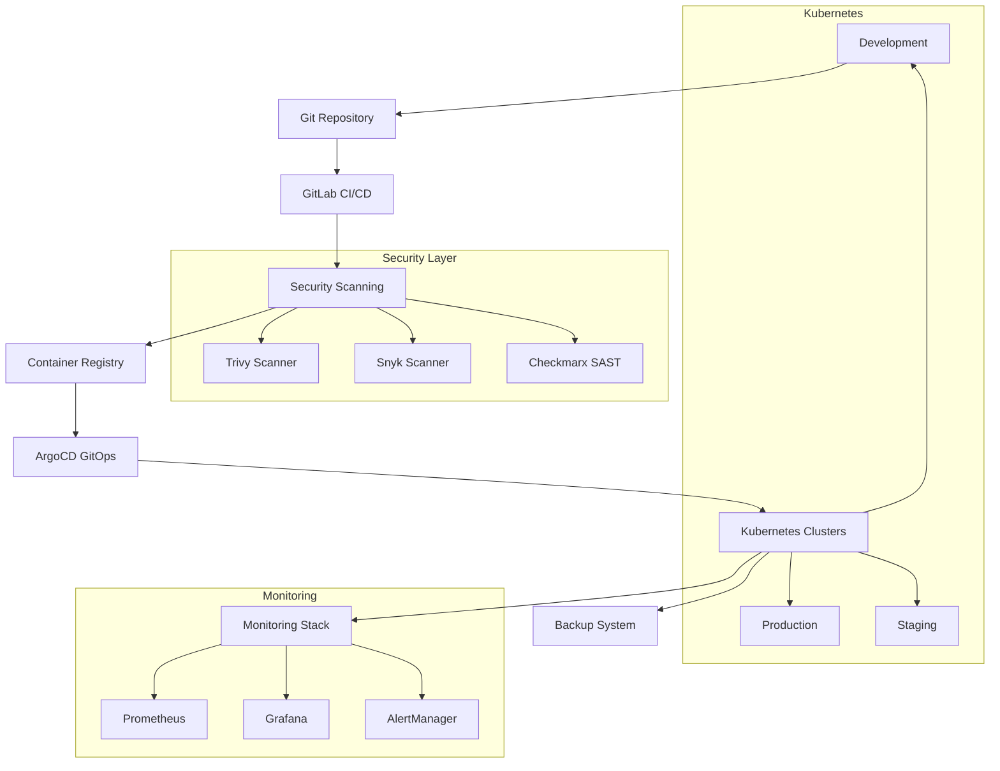

# Secure DevSecOps Pipeline - Complete Guide

## Table of Contents
1. [Overview](#overview)
2. [Architecture](#architecture)
3. [Quick Start](#quick-start)
4. [Component Documentation](#component-documentation)
5. [Operations Guide](#operations-guide)
6. [Security](#security)
7. [Troubleshooting](#troubleshooting)
8. [Contributing](#contributing)

## Overview

The Secure DevSecOps Pipeline is a production-ready, enterprise-grade DevSecOps platform that integrates security at every stage of the software development lifecycle. It provides automated security scanning, compliance monitoring, and infrastructure as code with GitOps workflows.

### Key Features
- ✅ **Advanced Security**: RBAC, Pod Security Standards, Network Policies, OPA Gatekeeper
- ✅ **CI/CD Pipeline**: Parallel execution, matrix builds, advanced caching
- ✅ **Comprehensive Monitoring**: Prometheus, Grafana, AlertManager with SLI/SLO tracking
- ✅ **Infrastructure as Code**: Terraform modules, Helm charts, environment automation
- ✅ **Testing Framework**: Unit, integration, e2e, performance, and security tests
- ✅ **GitOps Workflows**: ArgoCD with automated deployments and rollbacks
- ✅ **Backup & DR**: Velero-based backup with disaster recovery procedures
- ✅ **Documentation**: Complete operational runbooks and troubleshooting guides

### Technology Stack
- **Container Orchestration**: Kubernetes
- **CI/CD**: GitLab CI/CD
- **GitOps**: ArgoCD
- **Monitoring**: Prometheus, Grafana, AlertManager
- **Security Scanning**: Trivy, Snyk, Checkmarx
- **Infrastructure**: Terraform, Helm
- **Backup**: Velero
- **Testing**: Jest, Puppeteer, K6, Autocannon

## Architecture



### Environment Flow
```
Development → Staging → Production
     ↓           ↓         ↓
   Testing   UAT Testing  Monitoring
     ↓           ↓         ↓
  Security   Security   Security
  Scanning   Scanning   Scanning
```

## Quick Start

### Prerequisites
- Kubernetes cluster (1.24+)
- kubectl configured
- Helm 3.0+
- ArgoCD CLI
- Docker
- Git

### 1. Clone Repository
```bash
git clone https://github.com/ruslanbaba/Secure-DevSecOps-Pipeline.git
cd Secure-DevSecOps-Pipeline
```

### 2. Deploy Infrastructure
```bash
# Deploy infrastructure with Terraform
cd terraform
terraform init
terraform plan -var-file="environments/production.tfvars"
terraform apply -var-file="environments/production.tfvars"
```

### 3. Install ArgoCD
```bash
# Install ArgoCD
./gitops/scripts/gitops-workflow.sh deploy-argocd

# Setup applications
./gitops/scripts/gitops-workflow.sh setup-apps

# Get admin password
./gitops/scripts/gitops-workflow.sh get-password
```

### 4. Deploy Monitoring
```bash
# Apply monitoring stack
kubectl apply -f monitoring/
```

### 5. Setup Backup System
```bash
# Deploy Velero
kubectl apply -f backup/velero/

# Configure backup schedules
kubectl apply -f backup/velero/backup-schedules.yaml
```

### 6. Run Tests
```bash
# Install test dependencies
cd tests
npm install

# Run comprehensive test suite
./scripts/run-tests.sh
```

## Component Documentation

### Security Components
- [RBAC Configuration](docs/security/rbac.md)
- [Pod Security Standards](docs/security/pod-security.md)
- [Network Policies](docs/security/network-policies.md)
- [OPA Gatekeeper](docs/security/opa-gatekeeper.md)
- [Security Scanning](docs/security/scanning.md)

### CI/CD Pipeline
- [Pipeline Configuration](docs/cicd/pipeline-config.md)
- [Security Integration](docs/cicd/security-integration.md)
- [Performance Optimization](docs/cicd/performance.md)
- [Matrix Builds](docs/cicd/matrix-builds.md)

### Monitoring & Observability
- [Prometheus Setup](docs/monitoring/prometheus.md)
- [Grafana Dashboards](docs/monitoring/grafana.md)
- [AlertManager Rules](docs/monitoring/alerting.md)
- [SLI/SLO Definitions](docs/monitoring/sli-slo.md)

### Infrastructure as Code
- [Terraform Modules](docs/infrastructure/terraform.md)
- [Helm Charts](docs/infrastructure/helm.md)
- [Environment Management](docs/infrastructure/environments.md)

### Testing Framework
- [Unit Testing](docs/testing/unit-tests.md)
- [Integration Testing](docs/testing/integration-tests.md)
- [E2E Testing](docs/testing/e2e-tests.md)
- [Performance Testing](docs/testing/performance-tests.md)
- [Security Testing](docs/testing/security-tests.md)

### GitOps Workflows
- [ArgoCD Configuration](docs/gitops/argocd.md)
- [Application Management](docs/gitops/applications.md)
- [Environment Promotion](docs/gitops/promotion.md)
- [Rollback Procedures](docs/gitops/rollbacks.md)

### Backup & Disaster Recovery
- [Backup Strategy](docs/backup/strategy.md)
- [Velero Configuration](docs/backup/velero.md)
- [Disaster Recovery](docs/backup/disaster-recovery.md)
- [Testing Procedures](docs/backup/testing.md)

## Operations Guide

### Daily Operations
- Health checks and monitoring
- Log review and analysis
- Security scanning results
- Backup validation

### Incident Response
- Incident classification
- Response procedures
- Communication protocols
- Post-incident analysis

### Maintenance Procedures
- Scheduled maintenance windows
- Update procedures
- Capacity planning
- Performance tuning

### Runbooks
- [Application Deployment](docs/runbooks/deployment.md)
- [Scaling Operations](docs/runbooks/scaling.md)
- [Security Incident Response](docs/runbooks/security-incident.md)
- [Backup and Recovery](docs/runbooks/backup-recovery.md)
- [Certificate Management](docs/runbooks/certificate-management.md)

## Security

### Security Model
The pipeline implements a defense-in-depth security model:

1. **Code Security**: SAST, dependency scanning, secrets detection
2. **Build Security**: Signed images, vulnerability scanning
3. **Deployment Security**: RBAC, network policies, admission controllers
4. **Runtime Security**: Security monitoring, compliance enforcement
5. **Data Security**: Encryption at rest and in transit, backup security

### Security Policies
- [Access Control Policy](docs/security/policies/access-control.md)
- [Data Protection Policy](docs/security/policies/data-protection.md)
- [Incident Response Policy](docs/security/policies/incident-response.md)
- [Vulnerability Management](docs/security/policies/vulnerability-management.md)

### Compliance
- [SOC 2 Type II](docs/security/compliance/soc2.md)
- [ISO 27001](docs/security/compliance/iso27001.md)
- [GDPR](docs/security/compliance/gdpr.md)
- [HIPAA](docs/security/compliance/hipaa.md)

## Troubleshooting

### Common Issues
- Deployment failures
- Network connectivity issues
- Security policy violations
- Performance problems

### Diagnostic Tools
- Health check scripts
- Log analysis tools
- Performance profiling
- Security audit tools

## Performance Metrics

### SLI/SLO Targets
- **Availability**: 99.9%
- **Response Time**: P95 < 200ms
- **Error Rate**: < 0.1%
- **Deployment Success Rate**: > 99%

### Monitoring Dashboards
- [Application Performance](grafana/dashboards/application-performance.json)
- [Infrastructure Health](grafana/dashboards/infrastructure-health.json)
- [Security Metrics](grafana/dashboards/security-metrics.json)
- [Business Metrics](grafana/dashboards/business-metrics.json)

## Contributing

### Development Guide
- [Setup Development Environment](docs/development/setup.md)
- [Coding Standards](docs/development/coding-standards.md)
- [Testing Guidelines](docs/development/testing-guidelines.md)
- [Review Process](docs/development/review-process.md)

### Architecture Decisions
- [ADR-001: Technology Stack Selection](docs/architecture/adr-001-tech-stack.md)
- [ADR-002: Security Framework](docs/architecture/adr-002-security-framework.md)
- [ADR-003: Monitoring Strategy](docs/architecture/adr-003-monitoring-strategy.md)
- [ADR-004: GitOps Implementation](docs/architecture/adr-004-gitops.md)


