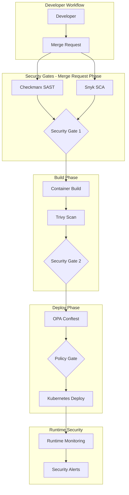
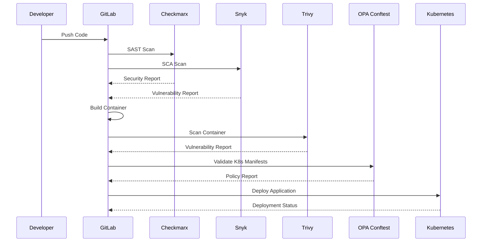

# Architecture Documentation

## System Architecture Overview

### High-Level Architecture



### Security-First Design Principles

1. **Shift-Left Security**: Security validation at every stage
2. **Zero-Trust Architecture**: Verify everything, trust nothing
3. **Fail-Fast**: Stop pipeline on critical security findings
4. **Policy as Code**: Automated policy enforcement
5. **Immutable Infrastructure**: Container-based deployments
6. **Continuous Monitoring**: Runtime security observability

### Component Architecture

#### CI/CD Pipeline Components

```yaml
stages:
  - security-scan      # SAST + SCA (Merge Request)
  - build-test        # Application build and unit tests
  - container-security # Container vulnerability scanning
  - policy-validation # OPA Conftest validation
  - deploy           # Kubernetes deployment
  - monitor          # Post-deployment monitoring
```

#### Security Tool Integration

- **Checkmarx SAST**: Static code analysis for vulnerabilities
- **Snyk SCA**: Software composition analysis for dependencies
- **Trivy**: Container image vulnerability scanning
- **OPA Conftest**: Policy validation for Kubernetes manifests

### Data Flow Architecture



### Security Gates and Thresholds

#### Gate 1: Merge Request Security
- **SAST**: No high/critical vulnerabilities
- **SCA**: No critical dependencies vulnerabilities
- **Code Quality**: Minimum quality score threshold

#### Gate 2: Container Security
- **Image Scan**: No critical CVEs
- **Base Image**: Approved base images only
- **Image Signing**: Signed and verified images

#### Gate 3: Policy Validation
- **Resource Limits**: CPU/Memory limits defined
- **Security Context**: Non-root containers
- **Network Policies**: Proper network segmentation
- **RBAC**: Least privilege access

### Scalability and Performance

- **Parallel Execution**: Security scans run in parallel
- **Caching Strategy**: Cache dependencies and build artifacts
- **Resource Optimization**: Efficient resource allocation
- **Fail-Fast**: Early termination on critical findings

### Disaster Recovery and Business Continuity

- **Pipeline Rollback**: Automated rollback on deployment failures
- **Security Incident Response**: Automated security incident handling
- **Backup Strategy**: Configuration and policy backup
- **Multi-Environment**: Development, staging, production isolation